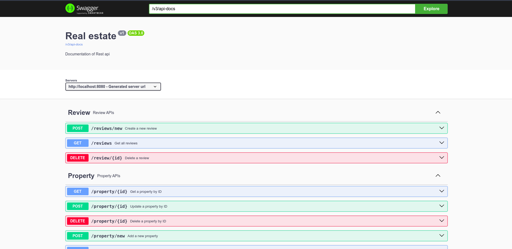

# Real Estate Application

This Real Estate Application is built with Spring Boot and provides a comprehensive platform for managing real estate listings, including property buying, selling, and renting functionalities. The application connects users with trusted agents, comprehensive property listings, and advanced search tools to facilitate a seamless real estate experience.

### Features
- User Authentication: Secure login and registration for users.
Property Listings: Browse, search, and filter properties by various criteria.
- Agent Management: Connect with and manage real estate agents.
- Property Management: Add, edit, and delete property listings.
- Reveiw management create and read review

### Technologies used
- Backend: Spring Boot, Spring Data JPA, Hibernate
- Database: Postgresql
- Security: Spring Security
- Build Tool: Maven

## Getting started
### Prequesities
- JDK 17 or Higher
- Maven 4.0.0 or higher
- Postgresql Database

### Installation
1. **Clone Repository**

    ```bash
    git clone https://github.com/SylvinIsamaza/e_state_backend.git
    cd e_state_backend
      ```
2. **Configure the database**
   - Create a PSQL database named realestate.
   - Update the database configuration in src/main/resources/application.properties

    ```properties
    spring.datasource.url=jdbc:postgresql://localhost:5432/realestate
    spring.datasource.username=your-username
    spring.datasource.password=your-password
      ```
3. **Build the application**
      ```bash
      mvn clean install
      ```
4. **Run the application**
    ``` bash
    mvn springboot:run
    ```
5. **Accessing the application**

    Open your web browser and navigate to http://localhost:8080/swagger-ui.html.

    You can use the Swagger UI to explore and test the API endpoints.

    

## Project Structure


- **src/main/java**: Contains the Java source files
  - **com.example.estate**: Main package
    - **config**: Configuration classes (e.g., `SecurityConfig.java`)
    - **controller**: REST controllers (e.g., `PropertyController.java`, `AgentController.java`, `UserController.java`)
    - **model**: Entity classes (e.g., `Property.java`, `Agent.java`, `User.java`)
    - **repository**: Data access layer interfaces (e.g., `PropertyRepository.java`, `AgentRepository.java`, `UserRepository.java`)
    - **service**: Business logic layer classes (e.g., `PropertyService.java`, `AgentService.java`, `UserService.java`)
    - **RealEstateApplication.java**: Main Spring Boot application class

 
  - **application.properties**: Application configuration
 
- **.gitignore**: Specifies files and directories to be ignored by Git
- **README.md**: Project documentation
- **mvnw**: Maven wrapper script for Unix-based systems
- **mvnw.cmd**: Maven wrapper script for Windows-based systems
- **pom.xml**: Project Object Model file for Maven

This structure ensures that the application is organized and follows best practices, making it easier to maintain and scale.

## Authors

- [@SylvinIsamaza](https://github.com/SylvinIsamaza)
# stating

# stating

